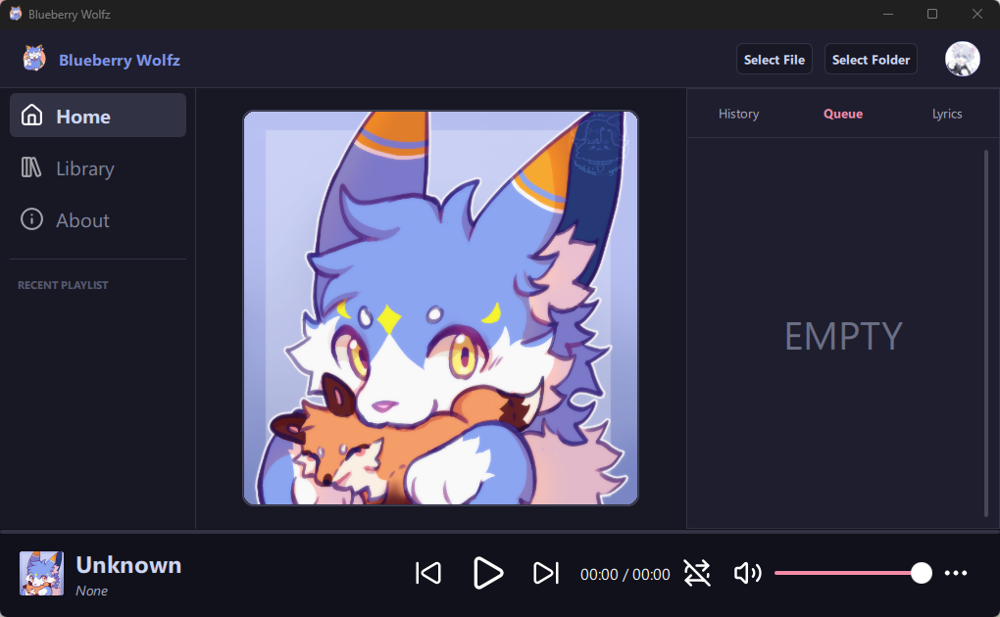

# Blueberry Wolfz

Blueberry Wolfz is a desktop music player built with **C++ and Qt Quick (QML)**.

This project started as a way to learn how to build a complete desktop application using Qt, while exploring QML for the user interface and C++ for the application logic.

The main goal of this project is not only creating a music player, but also learning how to design a maintainable application with a clear separation between UI, data, and core logic.

> Status: Work in Progress

---

## Preview

<p align="center">
  
</p>

---

## About

Blueberry Wolfz is a local music player designed around a simple idea:

- Keep the interface flexible and modernized with QML.
- Handle application logic with C++
- Store and manage user data efficiently
- Build an architecture that can grow with future features
- Work well with HD and FHD resolutions

The project is still under development, so some parts of the application may change over time.

---

## Tech Stack

- **Language:** C++17
- **UI Framework:** Qt Quick / QML
- **Framework:** Qt 6
  - Qt Core
  - Qt Multimedia
  - Qt SQL
  - Qt Quick
- **Database:** SQLite
- **Metadata:** TagLib
- **Build System:** CMake

Currently developed and tested on:

- Windows 10/11

Linux and macOS builds are planned but have not been fully tested yet.

---

## Current Features

Currently implemented:

- Local audio playback
- Play / Pause / Stop control
- Volume control
- Playlist management
- Single loop and queue loop
- Queue system
- Playback history
- QML-based user interface
- C++ backend exposed to QML
- Local database storage

More features will be added during development.

---

## Project Structure

```text
Blueberry_Wolfz
│
├── src
│   │
│   ├── main.cpp           # Application initialization
│   │
│   ├── ui
│   │   ├── Main.qml       # App entry point
│   │   ├── assets         # UI-related resources
│   │   ├── components     # Reusable QML components
│   │   ├── subviews       # Small, modular UI sections
│   │   └── views          # Main screens & layouts
│   │
│   ├── control
│   │   ├── controllers    # Button control and logic
│   │   └── services       # Database and info logic
│   │       └── uimodel    # Playlist model that show in UI
│   └── data
│       ├── models         # Data models
│       ├── playlist       # Playlist, queue, history
│       └── player         # Audio playback related classes
│
├── CMakeLists.txt
│
└── README.md

```

## Application Data Storage

Blueberry Wolfz stores user data separately from the application installation directory.

On Windows, application data is stored at:

```plainttext
%APPDATA%/Blueberry_Wolfz/
```

Used for persistent user data:

```plaintext
Blueberry_Wolfz/
│
└── songs.db
```

---

```plaintext
%LOCALAPPDATA%/Blueberry_Wolfz/
```

Used for local and temporary data:

```plaintext
Blueberry_Wolfz/
│
├── cache/
│
└── covers/
    ├── full/
    │
    └── mini/
```

Separating application data from the installation directory allows:

- User data to remain after application updates
- The application to be installed in different locations
- Cache and database files to be managed independently

---

## Architecture

Blueberry Wolfz follows a separation between the UI layer and application logic.

### QML Layer

Responsible for:

- User interface rendering
- User interaction
- UI state binding
- Animations and visual components

### C++ Layer

Responsible for:

- Audio playback control
- Playlist and queue management
- Database handling
- Application services
- Data processing

QML communicates with C++ through Qt properties, signals, and slots.

---

## Installation

### Windows

Download and run the installer:

```text
Blueberry_Wolfz_Setup.exe
```

Follow the installation wizard to install Blueberry Wolfz.

---

### Linux /  macOS

Linux and macOS builds are currently under development.

Native installers are not available yet.

---

## Future Plans

Some improvements planned for the future:

- Improve UI design and animations
- Add better music library management
- Add metadata reading and album artwork support
- Improve image caching system
- Optimize QML performance
- Improve C++ and QML integration
- Add better settings management
- Improve cross-platform support
- Improve UI responsiveness for high-resolution displays

---

## Notes

This project is mainly created for learning and experimentation.

The codebase may change frequently while exploring better solutions for:

- Qt application architecture
- Desktop UI design
- Data management
- Audio player development

---

## License

This project is licensed under the MIT License.

---

## Author

**Sói Con**

GitHub: https://github.com/SoiConk

---

## Credits

Some default artworks used in this app belong to their respective artists.

- Default Cover Art by [Linn](https://khomimi0708.carrd.co/)
- App Logo from [とおぼえ ふうすけ](https://potofu.me/tooboe-huusuke)
- Profile Icon by [Hoshino Chisara
](https://lit.link/en/tsrdtn)
- About by [Makiato](https://makiato-art.vercel.app/)
- Icons by [Lucide](https://lucide.dev)